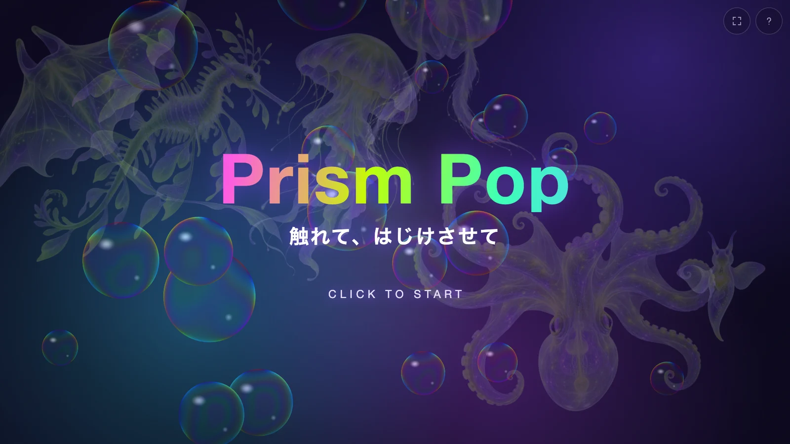
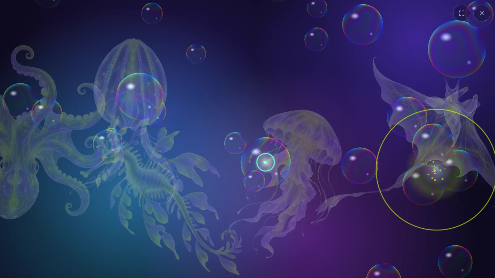
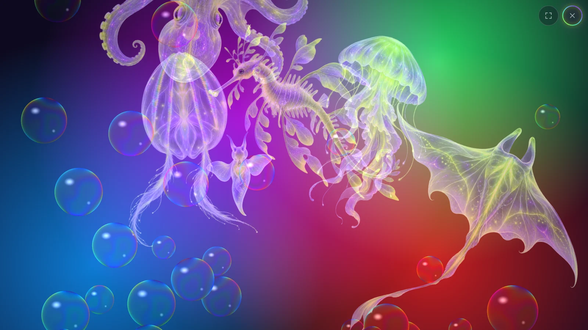
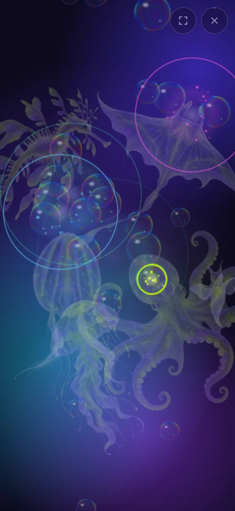

# Prism Pop

**触れて、はじけさせて。** 虹色の泡を割るたびに澄んだベルが鳴る、ブラウザで遊ぶ音と光のインタラクティブアート。

**[ブラウザで遊ぶ ─ prism-pop.nagai-shouten.workers.dev](https://prism-pop.nagai-shouten.workers.dev)**
インストール不要 / スマホ・PC 対応 / 音が出ます（ヘッドホン推奨）



[日本語](#日本語) | [English](#english)

## 日本語

泡の奥を、半透明の海の生き物がゆっくり漂っている。なんとなくひとつ割ると、光のしぶきと一緒に「ポン」とベルが鳴る。続けて割ると音が重なって和音になり、テンポよく割り続けるほど音は上へ駆け上がっていく。手を止めれば残響だけがしばらく漂い、また新しい泡が湧いてくる。

スコアも時間制限もない。好きなだけ鳴らしていい。

### 割るたびに、音楽になる



大きい泡は低いマリンバ、小さい泡は高いベル。鳴る音はすべて F リディアンの音階から選ばれるので、どんな順番で割っても響きが濁りにくい。間を空けずに割り続けるとコンボになり、8 個続けるたびに虹色の輪「プリズムバースト」が広がって、周りの泡が連鎖してはじける。

### 奥に棲む生き物たち

エイ、クリオネ、クシクラゲ、グラスオクトパス、リーフィーシードラゴン、クラゲ。泡のない所で生き物に触れると、それぞれのやり方で驚き、それぞれの声で鳴く。クラゲは傘を震わせて跳ね、シードラゴンはくるりと向きを変え、タコは噴射で逃げていく。

### 割り続けた先に



右上の × を囲む光の輪は、割った泡の数だけ少しずつ伸びていく。輪が一周したとき、何が起きるかは遊んで確かめてほしい。

### スマホでも



指でなぞれば通り道の泡をまとめて割れる。複数の指で触れれば、同時に何個でも割れる。画質は端末の性能に合わせて自動で切り替わる。

<br clear="right">

### 遊び方

| 操作 | 起きること |
|---|---|
| 泡に触れる | はじけて音が鳴る |
| 押したまま・指を置いたままなぞる | 通り道の泡をまとめて割る |
| 続けて割る | コンボで音が駆け上がる。8 個ごとにプリズムバースト |
| 泡のない所で生き物に触れる | 生き物が反応する |
| 右上のボタン | 全画面の切り替え / 遊び方（タイトル画面）/ タイトルに戻る（プレイ中、Esc でも可） |

- 音は最初のタップで鳴り始める（ブラウザの自動再生の制限のため）
- ヘッドホンやイヤホンで聴くと、音の広がりと残響がよく分かる
- 全画面で遊ぶには右上の全画面ボタンを押す。iPhone は Safari の共有メニューから「ホーム画面に追加」して、ホーム画面から開くと枠なしで遊べる

---

### 仕組み

- 音声ファイルを使わず、ベル・マリンバ・泡の破裂音・生き物の声・残響まで Web Audio API でその場で合成している
- 泡の膜は薄膜干渉（膜厚 220〜760nm・3 波長）とフレネル反射で描く
- 適応型画質: 2D 描画（standard）で起動し、端末に余裕があれば WebGL2 シェーダ（rich）へ自動で上げる。重くなれば自動で戻す
- 生き物は生成 AI（gpt-image-2）で作った半透明の画像。当たり判定は画像の不透明部分から作ったマスクで取る
- マウスとタッチは Pointer Events で統一。ホーム画面に追加すると全画面で起動する（Web App Manifest）

### 動かし方

必要なもの: Node.js 26（`web/.node-version`）、pnpm

```bash
git clone https://github.com/takunagai/prism-pop.git
cd prism-pop/web
pnpm install
pnpm dev       # 開発サーバー
pnpm build     # 型チェック → 本番ビルド（web/dist/）
pnpm preview   # ビルド結果の確認
```

デプロイは `pnpm build` の後に `wrangler deploy`（Cloudflare Workers の静的アセット配信、設定は `web/wrangler.jsonc`）。

開発用クエリ:

| クエリ | 効果 |
|---|---|
| `?mute` | 無音 |
| `?quality=standard` / `?quality=rich` | 画質を固定（自動判定しない） |
| `?debug` | 診断オーバーレイと `window.__prismDebug()` |
| `?pops=990` | 割った泡の累計の初期値（開発ビルドのみ。輪が一周したときの演出をすぐ確かめられる） |

### 技術構成

- TypeScript 6 + Vite 8
- p5.js 2（インスタンスモード）─ 入力・描画ループ・しぶき粒子
- Web Audio API ─ 音源の合成・残響（生成 IR）・リミッタ
- WebGL2 ─ rich 画質の背景・生き物・泡（全画面フラグメントシェーダ）
- Cloudflare Workers ─ 静的アセットの配信

### ドキュメント

| ファイル | 内容 |
|---|---|
| [docs/concept.md](docs/concept.md) | コンセプトシート（感情ゴール・操作・ビジュアル・音） |
| [docs/architecture.md](docs/architecture.md) | 設計の正本（モジュール構成・状態・音視覚マッピング・画質判定） |
| [docs/process-log.md](docs/process-log.md) | 制作記録（設計判断と見つけた不具合） |
| [web/README.md](web/README.md) | 視覚・操作・画質の調整ノブ一覧 |
| [web/src/audio/README-audio.md](web/src/audio/README-audio.md) | 音響の調整ノブ一覧 |

### ライセンス

[MIT](LICENSE) © 2026 ながたく (Taku Nagai) ─ [ナガイ商店.com](https://nagai-shouten.com/)

---

## English

**Touch it, let it pop.** An interactive art piece for the browser where every iridescent bubble you pop rings a clear bell.

**[Play in your browser ─ prism-pop.nagai-shouten.workers.dev](https://prism-pop.nagai-shouten.workers.dev)**
No install / works on phones and desktops / has sound (headphones recommended)

Translucent sea creatures drift slowly behind the bubbles. Pop one and a bell rings out with a spray of light. Keep popping and the notes stack into chords, climbing higher the faster you go. Stop, and only the reverb lingers while new bubbles rise. There is no score and no time limit ─ play as long as you like.

### Every pop becomes music

Large bubbles play low marimba notes; small ones play high bells. Every note comes from the F Lydian scale, so the harmony stays clean whatever order you pop in. Pop without pausing to build a combo, and every 8 pops a rainbow ring ─ the prism burst ─ sweeps outward and pops the bubbles around it in a chain.

### Creatures in the deep

A ray, a clione, a comb jelly, a glass octopus, a leafy seadragon and a jellyfish. Touch one where there are no bubbles and it startles in its own way, with its own voice.

### Keep popping

The glowing ring around the × button grows with every bubble you pop. What happens when it comes full circle is for you to find out.

### How to play

| Action | What happens |
|---|---|
| Touch a bubble | It pops and plays a note |
| Swipe (drag while pressing) | Pops every bubble along the path |
| Keep popping | The combo climbs the scale; a prism burst every 8 pops |
| Touch a creature where there are no bubbles | The creature reacts |
| Top-right buttons | Fullscreen / how to play (title screen) / back to title (while playing, or Esc) |

- Sound starts on the first tap (browser autoplay policy)
- On iPhone, use Safari's Share menu and "Add to Home Screen", then open it from the home screen to play without the browser frame

### Under the hood

- No audio files: bells, marimba, pop clicks, creature voices and reverb are all synthesized with the Web Audio API
- Bubble films are rendered with thin-film interference (220–760 nm thickness, 3 wavelengths) and Fresnel reflection
- Adaptive quality: starts with 2D rendering (standard) and upgrades to a WebGL2 shader (rich) when the device has headroom, then falls back automatically under load
- The creatures are translucent images made with generative AI (gpt-image-2); hit testing uses masks built from their opaque pixels

### Getting started

Requirements: Node.js 26 (`web/.node-version`), pnpm

```bash
git clone https://github.com/takunagai/prism-pop.git
cd prism-pop/web
pnpm install
pnpm dev       # dev server
pnpm build     # type check, then production build (web/dist/)
pnpm preview   # preview the build
```

Dev query parameters: `?mute` (no sound), `?quality=standard|rich` (fix the quality tier), `?debug` (diagnostic overlay and `window.__prismDebug()`), `?pops=990` (initial total pop count, dev builds only).

The design notes in `docs/` and the tuning tables in `web/README.md` are written in Japanese.

### License

[MIT](LICENSE) © 2026 Taku Nagai
